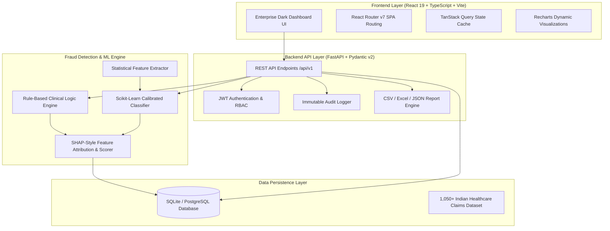

# HealthGuard AI 🛡️
### Enterprise Health Insurance Fraud Detection & SIU Investigation Platform

[](https://fastapi.tiangolo.com)
[](https://react.dev)
[](https://www.typescriptlang.org)
[](https://tailwindcss.com)
[](https://www.sqlalchemy.org)
[](https://scikit-learn.org)
[](https://python.org)

**HealthGuard AI** is a production-ready, full-stack enterprise Health Insurance Fraud Detection and Special Investigation Unit (SIU) Case Management Workbench. Built for health insurance payers, Third-Party Administrators (TPAs), and regulatory compliance teams, it combines hybrid rule-based clinical filters with machine learning risk scoring and transparent Explainable AI (XAI) feature attribution.

---

## 🏛️ System Architecture



---

## ✨ Key Features

### 1. 📊 Executive Fraud Risk Command Center
* **8 Real-Time Operational KPIs**: Total Claims, Scored Value (INR ₹), Flagged Fraud Amount, Prevention Savings, Active SIU Investigations, High-Risk Providers, System Precision Rate, and Avg Risk Score.
* **Trend & Time-Series Analysis**: Interactive claims volume and fraud velocity trajectory charts across 7-day, 30-day, 90-day, and 1-year windows.
* **Fraud Breakdown by Modality**: Upcoding, Duplicate Claims, Phantom Billing, Unbundled Services, Medical Necessity Violations, and Identity Fraud.
* **Geographic & Provider Risk Heatmaps**: State-level claims exposure across Maharashtra, Telangana, Karnataka, Tamil Nadu, Delhi NCR, Gujarat, and Andhra Pradesh.

### 2. 🔍 Surveillance & Automated Risk Triage
* **Continuous Claims Screening**: Auto-scores incoming claims with hybrid rule-evaluation and ML confidence modeling.
* **Calibrated Risk Tiers**: `CRITICAL` (Score 80–100), `HIGH` (60–79), `MEDIUM` (40–59), `LOW` (20–39), `NORMAL` (0–19).
* **Multi-Parameter Triage Filtering**: Filter by Risk Score, Claim Status, Modality, Hospital Provider, Member, and Date Range.
* **Interactive Claim Assessment**: Interactive circular risk gauge, patient/provider history cards, and ICD-10 diagnosis/CPT procedure itemization.

### 3. 🧠 Explainable AI (XAI) & Factor Attribution
* **Feature Weight Attribution**: Visual SHAP-style breakdown showing exact percentage contribution of each clinical and behavioral anomaly to the final risk score.
* **Plain-Language Reason Codes**: Transparent clinical justifications for investigator decision support (e.g., *“ICD-10 J18.9 pneumonia hospitalization billed for 14 days, exceeding standard clinical threshold of 6 days by 133%”*).

### 4. 🗂️ SIU Investigation Workbench
* **End-to-End Case Management**: Case assignment, priority reassessment, time tracking, status progression (`NEW`, `ASSIGNED`, `UNDER_REVIEW`, `INFO_REQUIRED`, `ESCALATED`, `CONFIRMED_FRAUD`, `FALSE_POSITIVE`, `CLOSED`).
* **Timestamped Activity Notes**: Multi-investigator collaborative notes and case logs.
* **Evidence & Digital Artifact Records**: File attachments tracking (medical records, hospital bills, forensic audit memos).
* **Final Enforcement Decisions**: Confirm Fraud (with recovery amount tracking), Clear as False Positive, or Flag Provider for Auditing.

### 5. 🏥 Hospital Network Provider Intelligence
* **Provider Risk Profiling**: Fraud rate benchmarking, average claim amount per admission, total submitted vs. flagged payout volume.
* **High-Risk Network Leaderboard**: Flag outlier hospitals with disproportionate high-severity claims.
* **Provider Specialty Breakdown**: Cardiology, Orthopedics, Oncology, General Surgery, Nephrology, and Critical Care risk distributions.

### 6. 👤 Policyholder Risk History & Timelines
* **Member Risk Trajectory**: Historical risk trend line charting policyholder claim history over time.
* **Hospitalization History**: Chronological hospital admission timeline to detect frequent hopper admissions and multi-facility overlaps.

### 7. ⚙️ Live Dynamic Fraud Rule Engine
* **Configurable Rules Matrix**: Modify rule weights, thresholds, and activation state without restarting services.
* **Rule Categories**: Duplicate detection, Excessive Billing, Length-of-Stay Outliers, Upcoding, Frequent Admissions, and Provider Network Risk.
* **Audit & Version History**: Automated version bump and audit logging on rule modifications.

### 8. 📑 Compliance Reporting & Regulatory Audit
* **Multi-Format Export**: Generate SIU Executive Summaries, High-Risk Provider Audits, and IRDAI Regulatory Reports in **CSV, Excel (XLSX), and JSON**.
* **Immutable Audit Trail**: SOX/IRDAI-compliant audit logging capturing every actor, action, timestamp, and before/after JSON diff state.

---

## 👥 Seed Demo Credentials

The platform comes pre-seeded with 3 pre-configured role personas for testing:

| Role | Email | Password | Access Privileges |
| :--- | :--- | :--- | :--- |
| **Administrator** | `admin@healthguard.ai` | `Admin@123` | Full system access, User management, Rule editing, Audit logs, Global Settings |
| **SIU Investigator** | `investigator@healthguard.ai` | `Invest@123` | Claims triage, Case management, Notes, Evidence upload, Enforcement decisions |
| **Risk Analyst** | `analyst@healthguard.ai` | `Analyst@123` | Read-only analytics, Dashboard KPIs, Claims exploration, Report generation |

---

## 🚀 Quick Start Guide

### Prerequisites
* **Python**: 3.12+ or 3.14+
* **Node.js**: 18.0+ or 20.0+
* **npm**: 9.0+

---

### Option A: Local Development

#### 1. Backend Setup
```bash
# Navigate to backend directory
cd backend

# Create and activate Python virtual environment
python -m venv venv

# Windows PowerShell:
.\venv\Scripts\Activate.ps1
# Linux/macOS:
# source venv/bin/activate

# Install dependencies
pip install -r requirements.txt

# Start FastAPI server (Runs on http://localhost:8000 with auto-seeded DB)
python -m uvicorn app.main:app --host 0.0.0.0 --port 8000 --reload
```

#### 2. Frontend Setup
```bash
# Navigate to frontend directory in a separate terminal
cd frontend

# Install dependencies
npm install

# Start Vite development server (Runs on http://localhost:5173)
npm run dev
```

Open your browser at **http://localhost:5173** and sign in using the demo buttons on the login screen.

---

### Option B: Docker Compose (Production Ready)

Run the entire full-stack platform (PostgreSQL + FastAPI + React Nginx) with a single command:

```bash
docker-compose up --build -d
```

* **Frontend Web Application**: [http://localhost](http://localhost)
* **Backend REST API**: [http://localhost:8000](http://localhost:8000)
* **Interactive Swagger UI**: [http://localhost:8000/docs](http://localhost:8000/docs)
* **Interactive ReDoc**: [http://localhost:8000/redoc](http://localhost:8000/redoc)

---

## 🧪 Running Automated Tests

Run the complete backend test suite:

```bash
cd backend
venv\Scripts\python -m pytest -v
```

All 9 end-to-end API integration tests verify:
1. `test_admin_login` (JWT issuance & admin RBAC)
2. `test_investigator_login` (Investigator authentication)
3. `test_dashboard_summary` (8 KPI metrics and aggregations)
4. `test_fraud_score_endpoint` (Real-time ML scoring & feature attribution)
5. `test_claims_list_and_filter` (Multi-parameter search and triage)
6. `test_fraud_rules_list` (Fraud rules matrix)
7. `test_investigation_creation_and_notes` (SIU workflow, notes, and activity)
8. `test_report_generation` (Background report jobs)
9. `test_audit_log_recording` (Immutable audit trail verification)

---

## 📡 Key REST API Endpoints

| Method | Endpoint | Description | Roles Allowed |
| :--- | :--- | :--- | :--- |
| `POST` | `/api/v1/auth/login` | User login and JWT access token issuance | Public |
| `GET` | `/api/v1/auth/me` | Fetch authenticated user profile & permissions | Any Authenticated |
| `GET` | `/api/v1/dashboard/summary` | Retrieve 8 executive KPI summary cards | Any Authenticated |
| `GET` | `/api/v1/dashboard/fraud-trends` | Time-series fraud velocity & volume trends | Any Authenticated |
| `GET` | `/api/v1/claims` | Paginated claims list with multi-parameter filters | Any Authenticated |
| `GET` | `/api/v1/claims/{id}` | Detailed claim view with member, provider & score | Any Authenticated |
| `POST` | `/api/v1/fraud/score` | Real-time claim scoring with ML & XAI factors | Any Authenticated |
| `GET` | `/api/v1/investigations` | Paginated SIU case queue | Any Authenticated |
| `GET` | `/api/v1/investigations/{id}` | Complete SIU investigation workbench & notes | Any Authenticated |
| `POST` | `/api/v1/investigations/{id}/notes` | Add timestamped investigator case note | Admin, Investigator |
| `PATCH` | `/api/v1/investigations/{id}/decision`| Enforce final fraud disposition & recovery | Admin, Investigator |
| `GET` | `/api/v1/providers` | Provider risk profiles and fraud leaderboards | Any Authenticated |
| `GET` | `/api/v1/fraud-rules` | List configurable fraud rules | Any Authenticated |
| `PUT` | `/api/v1/fraud-rules/{id}` | Update rule threshold or active status | Admin |
| `POST` | `/api/v1/reports/generate` | Generate CSV / Excel / JSON SIU report | Any Authenticated |
| `GET` | `/api/v1/audit-logs` | Query regulatory immutable audit trail | Admin |

---

## 📄 License & Compliance

Designed and implemented in compliance with **IRDAI (Insurance Regulatory and Development Authority of India)** guidelines, **SOX (Sarbanes-Oxley Act)** auditability, and modern health insurance fraud detection standards.
